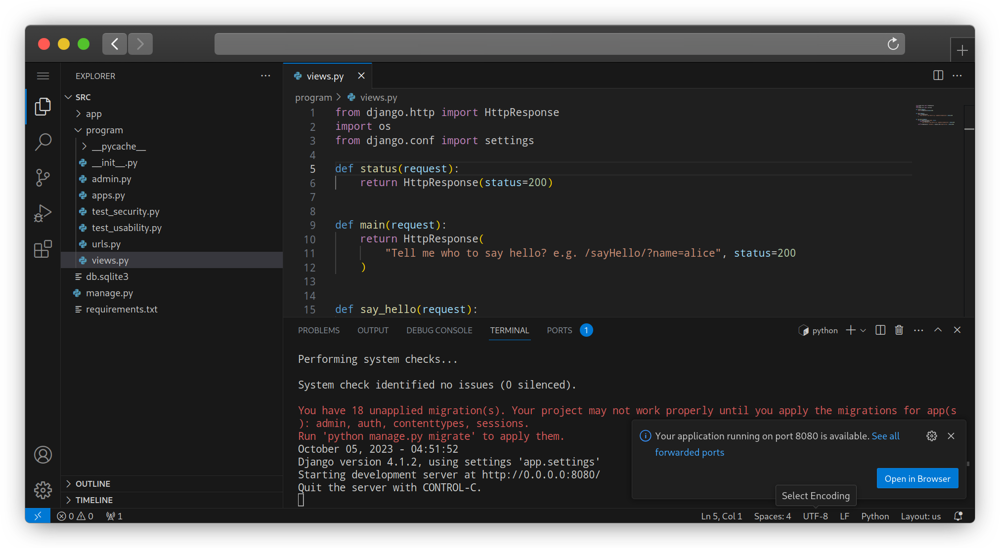
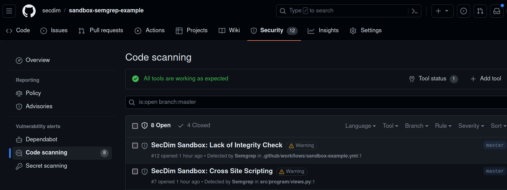
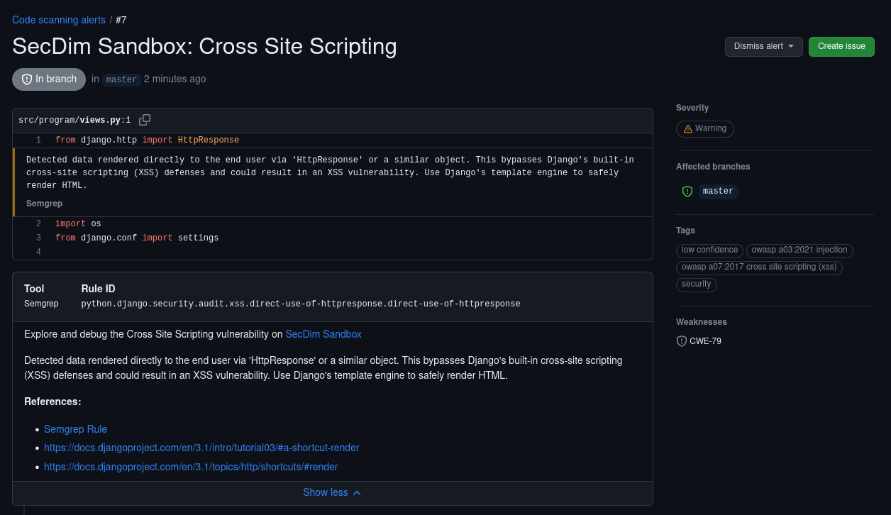

= SecDim Sandbox – The Secure Code Learning Wargame
:toc:
:toclevels: 2
:sectnums:
:icons: font
:github-actions-badge: https://github.com/secdim/sandbox-action/workflows/SecDim%20Sandbox%20Action/badge.svg
:version-badge: https://img.shields.io/github/v/tag/secdim/sandbox-action?label=version&color=blue

image::{github-actions-badge}[]
image::{version-badge}[]

[abstract]
SecDim Sandbox supercharges your security CI/CD by transforming static SARIF findings into interactive, containerized labs. Turn every vulnerability into a hands-on learning adventure—complete with AI-powered hints, real-world exploitation tests, and patch validation.

.Image: SecDim Sandbox Cloud Overview

[grid,cols="1,1"]
.Image: Security Tab Integration

.Image: Augmented Alerts

* **Instant Hands-On Labs** – Each finding links to a fully containerized demo you can spin up in seconds.
* **Real Attacker Simulations** – Built-in tests show you exactly how bad actors exploit each flaw.
* **AI Sidekick** – Our AI code assistant gives you context, hints, and validation feedback.
* **Seamless Privacy** – Only minimal metadata (e.g., CWE IDs) leaves your repo; your source code stays local.
* **Zero Config** – Works out of the box with any SARIF-producing tool (Semgrep, CodeQL, etc.).

== ✨ Key Features
- **SARIF Enrichment**: Scans your SARIF, enriches each finding with a lab link.
- **Catalog Lookup**: Queries the https://play.secdim.com/browse[SecDim Wargame catalog] for the best matching challenge.
- **Security Tab Integration**: Results appear right in your repo’s Security tab.
- **Customizable Templates**: Override lab URLs, link labels, or categories via inputs.
- **Cross-Scanner Support**: Plug into Semgrep, CodeQL, Sonar, and many others.

== 🔧 Example Workflow

[source,yaml]
----
name: "🚨 SecDim Sandbox CI"
on:
  push:
    branches: [ main ]
  pull_request:

jobs:
  sandbox:
    runs-on: ubuntu-latest
    permissions:
      security-events: write
      actions: read
      contents: read
    steps:
      - name: "🔍 Checkout Code"
        uses: actions/checkout@v2

      - name: "🐍 Setup Python 3.7"
        uses: actions/setup-python@v2
        with:
          python-version: "3.7"

      - name: "📦 Install Semgrep"
        run: pip install semgrep

      - name: "🚀 Run Semgrep Scan"
        run: semgrep scan --config auto --sarif > findings.sarif

      - name: "📤 Upload Semgrep Results"
        uses: github/codeql-action/upload-sarif@v2
        with:
          sarif_file: findings.sarif
          category: semgrep

      - name: "🛡️ Enrich SARIF with SecDim Wargame"
        uses: secdim/sandbox-action@v1.0.0
        with:
          input_sarif_file: findings.sarif
          output_sarif_file: findings.processed.sarif

      - name: "📤 Upload Enriched SARIF"
        uses: github/codeql-action/upload-sarif@v2
        with:
          sarif_file: findings.processed.sarif
          category: secdim-sandbox
----

== 🔒 Privacy & Security

[NOTE]
====
Your source code never leaves your environment. We only parse rule metadata (e.g., CWE IDs) and send tiny search queries to SecDim APIs. All heavy lifting stays in your CI runner.
====

== 🤔 FAQ

=== Do I need an account?
Nope—access to public labs is free. For private labs or enterprise features, mailto:support@secdim.com[contact us].

=== Can I tweak the action and output?
Absolutely! Check out https://github.com/secdim/sandbox-sarif-parser[SecDim Sandbox SARIF parser]:

== ❤️ Contributing

We ❤️ pull requests! Check out the sandbox-action repo and open an issue or PR.