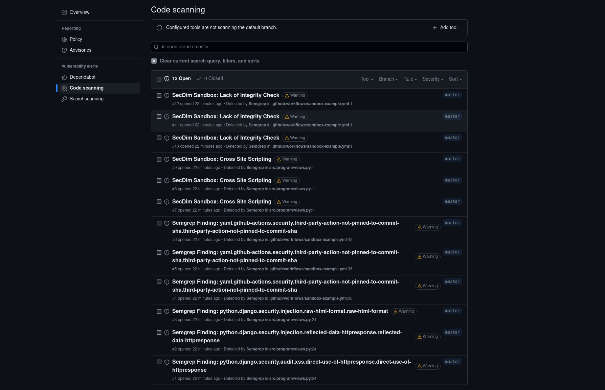
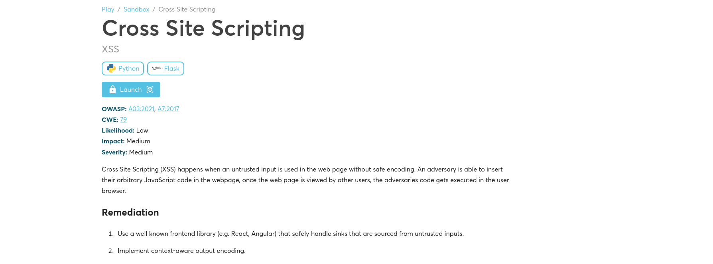

= SecDim Sandbox

 
image::images/code-scanning-alert-screenshot.png[] 
 

== Description

This Github Action will take a SARIF file, search https://secdim.com/[SecDim] for the relevant vulnerability SecDim Sandbox, and upload a new SARIF file detailing the vulnerabilities with links to the relevant https://play.secdim.com/sandbox/[SecDim Sandbox] to explore. The results can be viewed in the repository's Security tab.

Of note, none of your code is uploaded to SecDim. The SARIF file rule section is parsed for relevant search terms, and only these search terms are used to interact with SecDim APIs. To see more information, see our https://github.com/secdim/sandbox-sarif-parser[Sandbox SARIF Parser].

See https://github.com/secdim/sandbox-semgrep-example[our example repository] to see it in action. This repository will be scanned by Semgrep and output a SARIF file. This SARIF file is then process by our https://github.com/secdim/sandbox-sarif-parser[Sandbox SARIF Parser], with the results uploaded to the repository so you can view them in the repository's Security tab. Feel free to clone the repository and try it out yourself.

Alternatively, the YAML workflow file from https://github.com/secdim/sandbox-semgrep-example[the example repository] is included below:

```yaml
name: SecDim Sandbox Example Workflow
on:
  push:
    branches:
      - master
  pull_request:
jobs:
  secdim:
    runs-on: ubuntu-latest
    permissions:
      security-events: write
      actions: read
      contents: read
    steps:
      - name: Clone repo
        uses: actions/checkout@master

      - name: Set up Python
        uses: actions/setup-python@v2
        with:
          python-version: "3.7"

      - name: Install Semgrep
        run: pip install semgrep

      - name: Run Semgrep
        run: semgrep scan --config auto --sarif > findings.sarif

      - name: Upload Semgrep SARIF results
        uses: github/codeql-action/upload-sarif@v2
        with:
          sarif_file: findings.sarif
          category: semgrep

      - name: Run SecDim Sandbox Action
        uses: secdim/sandbox-action@v0.1.7-beta
        with:
          input_sarif_file: findings.sarif
          output_sarif_file: findings.processed.sarif

      - name: Upload SecDim Sanbox SARIF results
        uses: github/codeql-action/upload-sarif@v2
        with:
          sarif_file: findings.processed.sarif
          category: secdim-sandbox 
```
